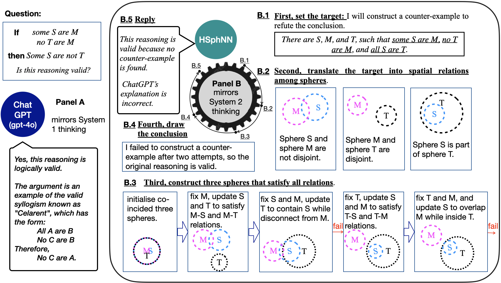

# Neural Reasoning for Sure through Constructing Explainable Models

---
Data, Code, and the supplementary document for the paper, *Neural Reasoning for Sure through Constructing Explainable Models*. AAAI-25.


---

## The supplementary document: 

[supplementary_document.pdf](https://github.com/gnodisnait/HSphNN/blob/main/supplementary_document.pdf)

---

## Installation


```
$ git clone https://github.com/gnodisnait/HSphNN.git
$ cd HSphNN
```

Paremeters are set in ```params.json```;

## Step 1. Download sample output dataset ```hsphnn_runs.zip``` 

[a sample experiment outputs can be downloaded at https://figshare.com/articles/dataset/Experiment_outputs_of_HSphNN/28060331](https://figshare.com/articles/dataset/Experiment_outputs_of_HSphNN/28060331)

## Step 2. Unzip ```hsphnn_runs.zip``` 

type following command to unzip ```hsphnn_runs.zip``` and move the data directory 
```
$ unzip hsphnn_runs.zip
```
After that, move the ```hsphnn_runs``` directory under the directory ```data``` as follows.
```
--
 |-/data/hsphnn_runs/
 |-/HSphNN/  
```
----
## Step 3. to see the results of the first experiment 

HSphNN achieves the symbolic-level of syllogistic reasoning with 1 epoch

```
$  python eval_exp1.py
```

The results are saved in the following files.
```
|--data
     |--hsphnn_runs
            |--ValidSyllogism_DIM2R1InitLoc0
            |--ValidSyllogism_DIM3R1InitLoc0
            |--ValidSyllogism_DIM15R1InitLoc0
            |--ValidSyllogism_DIM30R1InitLoc0 
            |--ValidSyllogism_DIM100R1InitLoc0
            |--ValidSyllogism_DIM200R1InitLoc0
            |--ValidSyllogism_DIM1000R1InitLoc0
            |--ValidSyllogism_DIM2000R1InitLoc0   
            |--ValidSyllogism_DIM3000R1InitLoc0     
```
```DIM3000``` means that spheres have the 3000 dimensions.

```R1``` means that spheres are initialised with their centres being located at the surface of a sphere with the radius of ```1```.

```InitLoc0``` means that spheres are initialised as being co-incided.

### Experiment result  

When spheres are initialised being coincided, HSphNN successfully identified all 24 valid syllogistic reasoning in one epoch. The dimension of sphere ranges from 2 to 3000.
```
+---------------------+-------+-----------------------------+--------------+
| Dimension of HSphere | epoch | #Identified Valid Reasoning | Total Number |
+---------------------+-------+-----------------------------+--------------+
|          2          |   1   |              24             |      24      |
|          3          |   1   |              24             |      24      |
|          15         |   1   |              24             |      24      |
|          30         |   1   |              24             |      24      |
|         100         |   1   |              24             |      24      |
|         200         |   1   |              24             |      24      |
|         1000        |   1   |              24             |      24      |
|         2000        |   1   |              24             |      24      |
|         3000        |   1   |              24             |      24      |
+---------------------+-------+-----------------------------+--------------+
```

Experiments show that it took HSphNN more time to determine a valid syllogistic reasoning than to determine an invalid one.

```
+-------------------+---------------------+----------------------------+---------+--------+----------+
| type of syllogism | number of syllogism | max time cost (in seconds) |  min -  | mean - | median - |
+-------------------+---------------------+----------------------------+---------+--------+----------+
|  valid syllogism  |         240         |           67.55            |   2.81  | 17.71  |  12.09   |
| invalid syllogism |         2320        |           66.29            | 0.00069 |  3.46  |   2.41   |
|   all syllogism   |         2560        |           67.55            | 0.00069 |  4.80  |   2.52   |
+-------------------+---------------------+----------------------------+---------+--------+----------+
```

 HSphNN is scalable with the increase of the dimension.


----

## Step 4. to see the results of the second experiment (HSphNN gave feedback to ChatGPT)

create a ```config``` directory in the ```HSphNN``` directory, and create the ```openai_key.txt``` file to save your API key of [openai](https://platform.openai.com/docs/quickstart). 

```
--
 |-/data/hsphnn_runs/
 |-/HSphNN/ 
      |--/config/
            |--openai_key.txt 
```

then, type
```
$  python eval_exp2.py
```

----

### Experiment results
```
****************************************************************************************************
using GPT-3.5-turbo, maximum 2 time feedback
../data/hsphnn_runs/ChatGPT3tb_short2_SphNN_words/
```
```_words``` at the end of the directory name means that syllogistic statements use meaningful words, such as ```all Greeks are human```.

The following table is the performance of ChatGPT gpt-3.5-turbo without the feedback from HSphNN.
```
no feedback
+---------------+----------+----------+----------+----------------+-------+------------------------+----------------------+
| #Correct+Expl | #HALLU 0 | #HALLU 1 | #HALLU 2 | #Inorrect+Expl | #Rest | #Ratio of Correct+Expl | #Irrationality ratio |
+---------------+----------+----------+----------+----------------+-------+------------------------+----------------------+
|      103      |    58    |    41    |    11    |       15       |   28  |       0.40234375       |      0.48828125      |
+---------------+----------+----------+----------+----------------+-------+------------------------+----------------------+
```
The following table is the performance of ChatGPT gpt-3.5-turbo with maximum two round of the feedback from HSphNN.

```
with maximum 2 times feedback
+---------------+----------+----------+----------+----------------+-------+------------------------+----------------------+
| #Correct+Expl | #HALLU 0 | #HALLU 1 | #HALLU 2 | #Inorrect+Expl | #Rest | #Ratio of Correct+Expl | #Irrationality ratio |
+---------------+----------+----------+----------+----------------+-------+------------------------+----------------------+
|      128      |    49    |    18    |    6     |       6        |   49  |          0.5           |      0.30859375      |
+---------------+----------+----------+----------+----------------+-------+------------------------+----------------------+
```
The following table lists the number of correct responses of ChatGPT gpt-3.5-turbo at the i-th feedback.

```
Number of correct decision and correct explanation vs. the number of feedbacks
+----------------------------------------------+-----+----+---+
|               #Num of feedback               |  0  | 1  | 2 |
+----------------------------------------------+-----+----+---+
| #Tasks with correct decision and explanation | 103 | 17 | 8 |
+----------------------------------------------+-----+----+---+
```


```
../data/hsphnn_runs/ChatGPT3tb_short2_SphNN_symbol/
```
```_symbol``` at the end of the directory name means that syllogistic statements use simple symbols, such as ```all S are M0```.
```
no feedback
+---------------+----------+----------+----------+----------------+-------+------------------------+----------------------+
| #Correct+Expl | #HALLU 0 | #HALLU 1 | #HALLU 2 | #Inorrect+Expl | #Rest | #Ratio of Correct+Expl | #Irrationality ratio |
+---------------+----------+----------+----------+----------------+-------+------------------------+----------------------+
|      120      |    0     |    73    |    33    |       14       |   16  |        0.46875         |       0.46875        |
+---------------+----------+----------+----------+----------------+-------+------------------------+----------------------+
with maximum 2 times feedback
+---------------+----------+----------+----------+----------------+-------+------------------------+----------------------+
| #Correct+Expl | #HALLU 0 | #HALLU 1 | #HALLU 2 | #Inorrect+Expl | #Rest | #Ratio of Correct+Expl | #Irrationality ratio |
+---------------+----------+----------+----------+----------------+-------+------------------------+----------------------+
|      151      |    2     |    30    |    19    |       4        |   50  |       0.58984375       |      0.21484375      |
+---------------+----------+----------+----------+----------------+-------+------------------------+----------------------+
Number of correct decision and correct explanation vs. the number of feedbacks
+----------------------------------------------+-----+----+----+
|               #Num of feedback               |  0  | 1  | 2  |
+----------------------------------------------+-----+----+----+
| #Tasks with correct decision and explanation | 120 | 17 | 14 |
+----------------------------------------------+-----+----+----+
```


```
../data/hsphnn_runs/ChatGPT3tb_short2_SphNN_random/
```
```_random``` at the end of the directory name means that syllogistic statements use random symbols, such as ```All HWsF1eq9 are hONvNxop```.

```
no feedback
+---------------+----------+----------+----------+----------------+-------+------------------------+----------------------+
| #Correct+Expl | #HALLU 0 | #HALLU 1 | #HALLU 2 | #Inorrect+Expl | #Rest | #Ratio of Correct+Expl | #Irrationality ratio |
+---------------+----------+----------+----------+----------------+-------+------------------------+----------------------+
|      106      |    1     |    45    |    38    |       17       |   49  |       0.4140625        |      0.39453125      |
+---------------+----------+----------+----------+----------------+-------+------------------------+----------------------+
with maximum 2 times feedback
+---------------+----------+----------+----------+----------------+-------+------------------------+----------------------+
| #Correct+Expl | #HALLU 0 | #HALLU 1 | #HALLU 2 | #Inorrect+Expl | #Rest | #Ratio of Correct+Expl | #Irrationality ratio |
+---------------+----------+----------+----------+----------------+-------+------------------------+----------------------+
|      138      |    4     |    20    |    19    |       1        |   74  |       0.5390625        |       0.171875       |
+---------------+----------+----------+----------+----------------+-------+------------------------+----------------------+
Number of correct decision and correct explanation vs. the number of feedbacks
+----------------------------------------------+-----+----+----+
|               #Num of feedback               |  0  | 1  | 2  |
+----------------------------------------------+-----+----+----+
| #Tasks with correct decision and explanation | 106 | 20 | 12 |
+----------------------------------------------+-----+----+----+
```
----

The following tables were the performances of ChatGPT-4o. 

```
../data/hsphnn_runs/ChatGPT4o_short2_SphNN_words/
no feedback
+---------------+----------+----------+----------+----------------+-------+------------------------+----------------------+
| #Correct+Expl | #HALLU 0 | #HALLU 1 | #HALLU 2 | #Inorrect+Expl | #Rest | #Ratio of Correct+Expl | #Irrationality ratio |
+---------------+----------+----------+----------+----------------+-------+------------------------+----------------------+
|      191      |    15    |    8     |    20    |       17       |   5   |       0.74609375       |       0.234375       |
+---------------+----------+----------+----------+----------------+-------+------------------------+----------------------+
with maximum 2 times feedback
+---------------+----------+----------+----------+----------------+-------+------------------------+----------------------+
| #Correct+Expl | #HALLU 0 | #HALLU 1 | #HALLU 2 | #Inorrect+Expl | #Rest | #Ratio of Correct+Expl | #Irrationality ratio |
+---------------+----------+----------+----------+----------------+-------+------------------------+----------------------+
|      194      |    20    |    10    |    10    |       17       |   5   |       0.7578125        |      0.22265625      |
+---------------+----------+----------+----------+----------------+-------+------------------------+----------------------+
Number of correct decision and correct explanation vs. the number of feedbacks
+----------------------------------------------+-----+---+---+
|               #Num of feedback               |  0  | 1 | 2 |
+----------------------------------------------+-----+---+---+
| #Tasks with correct decision and explanation | 191 | 3 | 0 |
+----------------------------------------------+-----+---+---+
../data/hsphnn_runs/ChatGPT4o_short2_SphNN_symbol/
no feedback
+---------------+----------+----------+----------+----------------+-------+------------------------+----------------------+
| #Correct+Expl | #HALLU 0 | #HALLU 1 | #HALLU 2 | #Inorrect+Expl | #Rest | #Ratio of Correct+Expl | #Irrationality ratio |
+---------------+----------+----------+----------+----------------+-------+------------------------+----------------------+
|      196      |    3     |    13    |    20    |       19       |   5   |        0.765625        |      0.21484375      |
+---------------+----------+----------+----------+----------------+-------+------------------------+----------------------+
with maximum 2 times feedback
+---------------+----------+----------+----------+----------------+-------+------------------------+----------------------+
| #Correct+Expl | #HALLU 0 | #HALLU 1 | #HALLU 2 | #Inorrect+Expl | #Rest | #Ratio of Correct+Expl | #Irrationality ratio |
+---------------+----------+----------+----------+----------------+-------+------------------------+----------------------+
|      202      |    8     |    13    |    9     |       23       |   1   |       0.7890625        |      0.20703125      |
+---------------+----------+----------+----------+----------------+-------+------------------------+----------------------+
Number of correct decision and correct explanation vs. the number of feedbacks
+----------------------------------------------+-----+---+---+
|               #Num of feedback               |  0  | 1 | 2 |
+----------------------------------------------+-----+---+---+
| #Tasks with correct decision and explanation | 196 | 5 | 1 |
+----------------------------------------------+-----+---+---+
../data/hsphnn_runs/ChatGPT4o_short2_SphNN_random/
no feedback
+---------------+----------+----------+----------+----------------+-------+------------------------+----------------------+
| #Correct+Expl | #HALLU 0 | #HALLU 1 | #HALLU 2 | #Inorrect+Expl | #Rest | #Ratio of Correct+Expl | #Irrationality ratio |
+---------------+----------+----------+----------+----------------+-------+------------------------+----------------------+
|      211      |    1     |    4     |    16    |       18       |   6   |       0.82421875       |      0.15234375      |
+---------------+----------+----------+----------+----------------+-------+------------------------+----------------------+
with maximum 2 times feedback
+---------------+----------+----------+----------+----------------+-------+------------------------+----------------------+
| #Correct+Expl | #HALLU 0 | #HALLU 1 | #HALLU 2 | #Inorrect+Expl | #Rest | #Ratio of Correct+Expl | #Irrationality ratio |
+---------------+----------+----------+----------+----------------+-------+------------------------+----------------------+
|      217      |    4     |    2     |    9     |       18       |   6   |       0.84765625       |      0.12890625      |
+---------------+----------+----------+----------+----------------+-------+------------------------+----------------------+
Number of correct decision and correct explanation vs. the number of feedbacks
+----------------------------------------------+-----+---+---+
|               #Num of feedback               |  0  | 1 | 2 |
+----------------------------------------------+-----+---+---+
| #Tasks with correct decision and explanation | 211 | 4 | 2 |
+----------------------------------------------+-----+---+---+
****************************************************************************************************
```
----

We increase the maximum number of feedback to 10 round and found that ChatGPT was not sensitive to the repetition. 
```
no feedback
+---------------+----------+----------+----------+----------------+-------+------------------------+----------------------+
| #Correct+Expl | #HALLU 0 | #HALLU 1 | #HALLU 2 | #Inorrect+Expl | #Rest | #Ratio of Correct+Expl | #Irrationality ratio |
+---------------+----------+----------+----------+----------------+-------+------------------------+----------------------+
|      211      |    0     |    6     |    17    |       17       |   5   |       0.82421875       |       0.15625        |
+---------------+----------+----------+----------+----------------+-------+------------------------+----------------------+
with maximum 10 times feedback
+---------------+----------+----------+----------+----------------+-------+------------------------+----------------------+
| #Correct+Expl | #HALLU 0 | #HALLU 1 | #HALLU 2 | #Inorrect+Expl | #Rest | #Ratio of Correct+Expl | #Irrationality ratio |
+---------------+----------+----------+----------+----------------+-------+------------------------+----------------------+
|      218      |    6     |    6     |    4     |       18       |   4   |       0.8515625        |      0.1328125       |
+---------------+----------+----------+----------+----------------+-------+------------------------+----------------------+
Number of correct decision and correct explanation vs. the number of feedbacks
+----------------------------------------------+-----+---+---+---+---+---+---+---+---+---+----+
|               #Num of feedback               |  0  | 1 | 2 | 3 | 4 | 5 | 6 | 7 | 8 | 9 | 10 |
+----------------------------------------------+-----+---+---+---+---+---+---+---+---+---+----+
| #Tasks with correct decision and explanation | 211 | 5 | 1 | 0 | 0 | 0 | 1 | 0 | 0 | 0 | 0  |
+----------------------------------------------+-----+---+---+---+---+---+---+---+---+---+----+
```

------

### A case of ```Correct+Expl``` (correct decision with correct explanation).

***Decide the satisfiability of the three statements (log_data_33.json):*** 
```
all S are M0. no M0 are P. some S are not P.
```
(i) HSphNN decides it satisiable. 

(ii) ChatGPT (gpt-3.5-turbo) decides it satisiable and gives an explanation: 
```
(circle S, inside, circle M0)
(circle M0, outside, circle P)
(circle S, outside, circle P)
```
Here, it is correct that ```all S are M0``` can be explained as ```(circle S, inside, circle M0)``` and 
```no M0 are P``` can be explained as ```(circle M0, outside, circle P)``` and ```some S are not P``` can be explained as ```(circle S, outside, circle P)```.

(iii) HSphNN tries to construct a model for ChatGPT's explanation and finds the explanation is satisfiable. 

(iv) Therefore, ChatGPT (gpt-3.5-turbo) gives a correct decision and correct explanations. 


### A case of ```HALLU 0``` (correct decisioin with a partial explanation )

LLM may make a correct decisioin and gives a partial explanation that cannot lead to any conclusion.

***Decide the satisfiability of the three statements (log_data_64.json):*** 
```
some S are not M0. all M0 are P. all S are P.
```
(i) HSphNN decides it satisiable. 

(ii) ChatGPT (gpt-3.5-turbo) decides it satisiable and gives a partial explanation: 
```
(circle S, inside, circle P)
(circle P, inside, circle M0)
(circle M0, inside, circle P)
```
In ChatGPT's explanation, the relation between ```S``` and ```M0``` is missing.

(iii) Therefore, ChatGPT (gpt-3.5-turbo) hallucinated a correct decision based on a partial explanation. 

Note: the relation ```(circle P, inside, circle M0)```and ```(circle M0, inside, circle P)``` is not contradictory. The two relations will follow that ```M0``` and ```P``` are coincided.

### A case of ```HALLU 1``` (correct decisioin with an incorrect explanation)

LLM may make a correct decisioin and gives an incorrect explanation for at least one single statement.

***Decide the satisfiability of the three statements (log_data_168.json):***
```
no M0 are S. no M0 are P. all S are P.
```
(i) HSphNN decides it satisiable. 

(ii) ChatGPT (gpt-3.5-turbo) decides it satisiable and gives an explanation: 
```
(circle P, inside, circle M0)
(circle M0, outside, circle S)
(circle S, inside, circle P)
```
Here, ChatGPT mistakenly interpreted ```no M0 are P``` as ```(circle P, inside, circle M0)```.

(iii) Therefore, ChatGPT (gpt-3.5-turbo) hallucinated a correct decision based on an incorrect explanation. 


### A case of ```HALLU 2``` (correct decisioin with correct but irrelavent explanations)

LLM may make a correct decisioin and gives correct explanation for each single statement, but the whole explanation is incorrect.

***Decide the satisfiability of the three statements:*** 
```
some M0 are not S. all M0 are P. some S are not P.
```
(i) HSphNN decides it satisiable. 

(ii) ChatGPT (gpt-3.5-turbo) decides it satisiable and gives an explanation: 
```
(circle M0, overlaps, circle S)
(circle M0, inside, circle P)
(circle S, outside, circle P)
```
Here, it is correct that ```some M0 are not S``` can be explained as ```(circle M0, overlaps, circle S)``` and 
```all M0 are P``` can be explained as ```(circle M0, inside, circle P)``` and ```some S are not P``` can be explained as ```(circle S, outside, circle P)```.

(iii) HSphNN tries to construct a model for ChatGPT's explanation and finds the explanation is unsatisfiable. 

(iv) Therefore, ChatGPT (gpt-3.5-turbo) gives a correct decision and correct explanation for each statement, but with an incorrect explanation. 


### A case of ```Inorrect+Expl``` (incorrect decision with a correct explanation)

***Decide the satisfiability of the three statements:***
```
all S are M0. no M0 are P. all S are P.
```
(i) HSphNN decides it unsatisiable. 

(ii) ChatGPT (gpt-3.5-turbo) decides it satisiable and gives an explanation: 
```
(circle S, inside, circle M0) 
(circle M0, outside, circle P)
(circle S, inside, circle P)
```
The explanation is correct for each single statement and for the whole.

(iii) Therefore, ChatGPT (gpt-3.5-turbo) gives an incorrect decision with a correct explanation. 


### A case of ```Rest``` (incorrect decision with incorrect explanation)
***Decide the satisfiability of the three statements (log_data_24.json):*** 
```
all M0 are S. some M0 are not P. all S are P.
```
(i) HSphNN decides it unsatisiable. 

(ii) ChatGPT (gpt-3.5-turbo) decides it satisiable and gives an explanation: 
```
(circle M0, inside, circle S) 
(circle S, overlaps, circle P)
(circle M0, inside, circle P)
```
Here, it is not correct that ```all S are P``` can be explained as ```(circle S, overlaps, circle P)```.

(iii) Therefore, ChatGPT (gpt-3.5-turbo) gives an incorrect decision with an incorrect explanation. 


------

## Step 5. to run the source code.

### create the ```hsphnn``` virtual environment by typing following commands (tested at MacOS M1)

```
$ conda create --name hsphnn python=3.9
$ conda activate hsphnn
$ conda install pytorch::pytorch torchvision torchaudio -c pytorch
$ conda install conda-forge::openai==0.28
$ conda install conda-forge::matplotlib
$ conda install conda-forge::tensorboard
$ conda install conda-forge::prettytable
```

------

### run the first experiment
```
$ ./experiment1.sh
```
 
### run the second experiment
```
$ ./experiment2.sh
```

------

### License

This repository can be used for non-commercial purposes only. 
Contact one of the three authors of the paper below, if you are interested in a commercial license.

------

### Reference

```
@inproceedings{djl2025,
  author    = {Tiansi Dong and Mateja Jamnik and Pietro Liò},
  title     = {Neural Reasoning for Sure through Constructing Explainable Models},
  booktitle = {AAAI},  
  year = {2025},  
}
``` 