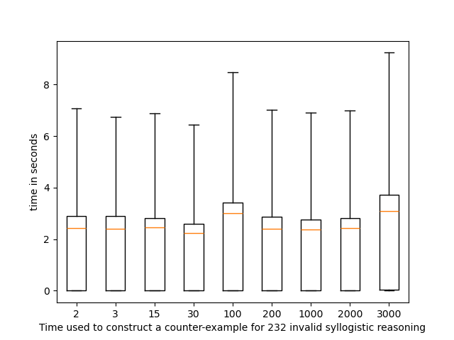

# Neural Reasoning for Sure through Constructing Explainable Models
## Paremeters are set in ```params.json``` 


# Step 1. Download sample output dataset ```hsphnn_runs.zip``` 

[a sample experiment outputs can be downloaded at https://figshare.com/articles/dataset/Experiment_outputs_of_HSphNN/28060331](https://figshare.com/articles/dataset/Experiment_outputs_of_HSphNN/28060331)

# Step 2. Unzip ```data.zip``` 

type following command to unzip ```hsphnn_runs.zip``` and move the data directory 
```
$ unzip data.zip
```
After that, the directory structure is as follows.
```
--
 |-/data/hsphnn_runs/
 |-/HSphNN/ 
      |--/config/
      |--/data/
      |--/Syllogism
      |--/ValidSyllogism
```
# Step 3. to see the results of the first experiment  

The results are saved in the following files.
```
|--data
     |--hsphnn_runs
            |--ValidSyllogism_DIM2R1InitLoc0
            |--ValidSyllogism_DIM3R1InitLoc0
            |--ValidSyllogism_DIM15R1InitLoc0
            |--ValidSyllogism_DIM30R1InitLoc0 
            |--ValidSyllogism_DIM100R1InitLoc0
            |--ValidSyllogism_DIM200R1InitLoc0
            |--ValidSyllogism_DIM1000R1InitLoc0
            |--ValidSyllogism_DIM2000R1InitLoc0   
            |--ValidSyllogism_DIM3000R1InitLoc0     
```
```DIM3000``` means that spheres have the 3000 dimensions.
```R1``` means that spheres are initialised with their centres being located at the surface of a sphere with the radius of ```1```.
```InitLoc0``` means that spheres are initialised as being co-incided.

## Experiment result  

When spheres are initialised being coincided, HSphNN successfully identified all 24 valid syllogistic reasoning in one epoch. The dimension of sphere ranges from 2 to 3000.
```
+---------------------+-------+-----------------------------+--------------+
| Dimension of HSphere | epoch | #Identified Valid Reasoning | Total Number |
+---------------------+-------+-----------------------------+--------------+
|          2          |   1   |              24             |      24      |
|          3          |   1   |              24             |      24      |
|          15         |   1   |              24             |      24      |
|          30         |   1   |              24             |      24      |
|         100         |   1   |              24             |      24      |
|         200         |   1   |              24             |      24      |
|         1000        |   1   |              24             |      24      |
|         2000        |   1   |              24             |      24      |
|         3000        |   1   |              24             |      24      |
+---------------------+-------+-----------------------------+--------------+
```

Experiments show that it took HSphNN more time to determine a valid syllogistic reasoning than to determine an invalid one.

```
+-------------------+---------------------+----------------------------+---------+--------+----------+
| type of syllogism | number of syllogism | max time cost (in seconds) |  min -  | mean - | median - |
+-------------------+---------------------+----------------------------+---------+--------+----------+
|  valid syllogism  |         240         |           67.55            |   2.81  | 17.71  |  12.09   |
| invalid syllogism |         2320        |           66.29            | 0.00069 |  3.46  |   2.41   |
|   all syllogism   |         2560        |           67.55            | 0.00069 |  4.80  |   2.52   |
+-------------------+---------------------+----------------------------+---------+--------+----------+
```

 HSphNN is scalable with the increase of the dimension.




